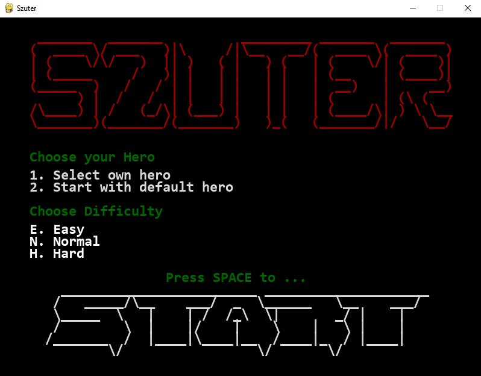
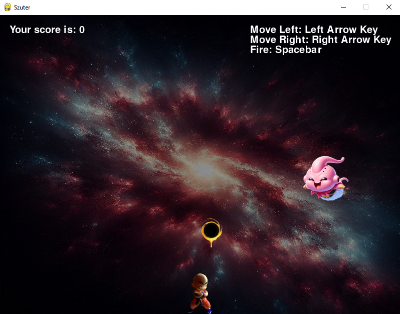

## 🚀 **SZUTER – Arcade Alien Shooter**

Defend Earth from an alien invasion in this retro-style arcade game.
Built with Python + Pygame, SZUTER lets you dodge, shoot, and survive waves of enemies — with customizable heroes and dynamic gameplay that gets harder the longer you last.

## 🎮 **Features**

- **Customizable Hero**: Choose your hero's appearance from a selection of images or use a default character.
- **Intuitive Controls**: Play using keyboard, with the option to select menu items.
- **Dynamic Gameplay**: The game gets progressively harder as the alien speed increases over time.
- **ASCII Art**: Enjoy a retro feel with an ASCII logo displayed in the game menu.
- **Score Tracking**: Your score increases with each alien defeated.

## 🛠️ **Installation**

1. **Clone the repository**:
    ```bash
    git clone https://github.com/draprar/pygame-szuter.git
    ```
2. **Navigate to the project directory**:
    ```bash
    cd pygame-szuter
    ```
3. **Create a virtual environment (optional but recommended)**:
    ```bash
    python -m venv venv
    source venv/bin/activate  # On Windows use `venv\Scripts\activate`
    ```
4. **Install dependencies**:
    ```bash
    pip install -r requirements.txt
    ```
5. **Run the game**:
    ```bash
    python main.py
    ```

## 🎯 **How to Play**

- **Menu Navigation**:
  - Press `1` or `2` on your keyboard to select your own hero or default one.
  - Press `E`, `N` or `H` on your keyboard to select difficulty level.
  - Press `SPACE` to start the game.
  
- **In-Game Controls**:
  - Move Left: `Left Arrow Key`
  - Move Right: `Right Arrow Key`
  - Fire: `Spacebar`

- **Objective**: Avoid collisions with aliens while shooting them down. Survive as long as possible to achieve a high score.

## 🪕 **Game Mechanics**

- **Alien Movement**: Aliens move diagonally across the screen, changing direction only when they hit the screen's edges.
- **Speed Increase**: Alien speed increases after every reach the bottom of the screen, making the game progressively harder.
- **Collision Detection**: If an alien collides with your hero, the game ends.

## 🪒 **Customization**

- **Hero Selection**: Customize your hero by selecting your own image in the menu.
- **Background and Graphics**: Modify images in the `img/` directory to change the game's appearance.

## 👤 **Credits**

- **Developer**: Walery ([@draprar](https://github.com/draprar/))
- **ASCII Art**: Custom-generated for this game.

