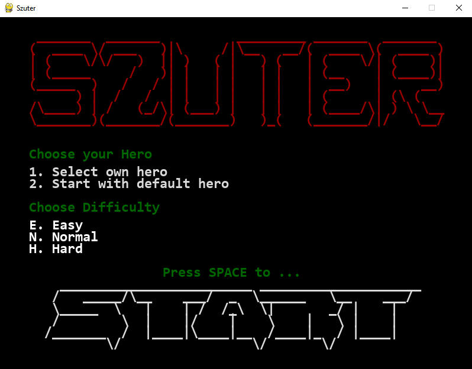
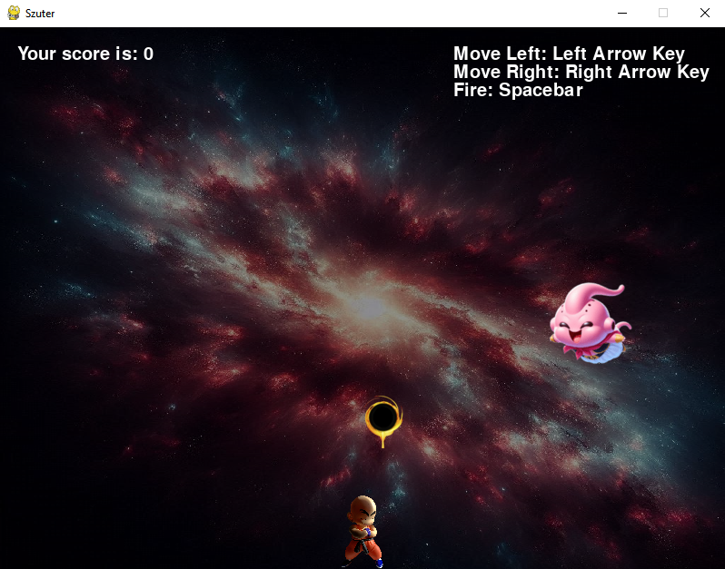

## **SZUTER – Arcade Alien Shooter**

Defend Earth from an alien invasion in this retro-style arcade game.
Built with Python + Pygame, SZUTER lets you dodge, shoot, and survive waves of enemies — with customizable heroes and dynamic gameplay that gets harder the longer you last.

## **Features**

- **Customizable Hero**: Choose your hero's appearance from a selection of images or use a default character.
- **Intuitive Controls**: Play using keyboard, with the option to select menu items.
- **Dynamic Gameplay**: The game gets progressively harder as the alien speed increases over time.
- **ASCII Art**: Enjoy a retro feel with an ASCII logo displayed in the game menu.
- **Score Tracking**: Your score increases with each alien defeated.

## **Requirements**

| Dependency | Version |
|------------|---------|
| Python     | 3.11 or 3.12 |
| pygame     | 2.6.1  |

> **Windows users**: make sure you are using a pre-built wheel (`pip install pygame==2.6.1`).  
> Building from source is **not** supported on Python 3.12 due to the removal of `distutils`.

## **Installation**

1. **Clone the repository**:
    ```bash
    git clone https://github.com/draprar/pygame-szuter.git
    cd pygame-szuter
    ```

2. **Create a virtual environment** (recommended):
    ```bash
    python -m venv venv
    # Windows:
    venv\Scripts\activate
    # macOS / Linux:
    source venv/bin/activate
    ```

3. **Install runtime dependencies**:
    ```bash
    pip install -r requirements.txt
    ```

4. **Run the game**:
    ```bash
    python main.py
    ```

## **Running Tests**

Install dev dependencies (includes pytest, ruff, mypy):
```bash
pip install -r requirements-dev.txt
```

Run the test suite:
```bash
pytest
```

Run the linter:
```bash
ruff check .
```

## **How to Play**

- **Menu Navigation**:
  - Press `1` or `2` on your keyboard to select your own hero or default one.
  - Press `E`, `N` or `H` on your keyboard to select difficulty level.
  - Press `SPACE` to start the game.

- **In-Game Controls**:
  - Move Left: `Left Arrow Key`
  - Move Right: `Right Arrow Key`
  - Fire: `Spacebar`

- **Objective**: Avoid collisions with aliens while shooting them down. Survive as long as possible to achieve a high score.

## **Game Mechanics**

- **Alien Movement**: Aliens move diagonally across the screen, changing direction only when they hit the screen's edges.
- **Speed Increase**: Alien speed increases each time the alien reaches the bottom or is shot down, making the game progressively harder.
- **Collision Detection**: If an alien collides with your hero, the game ends.

## **Customization**

- **Hero Selection**: Customize your hero by selecting your own image in the menu (PNG, JPG, GIF supported).
- **Background and Graphics**: Modify images in the `img/` directory to change the game's appearance.

> **Note on assets**: game graphics in `img/` were created for this project and are distributed under the same MIT licence as the source code.

## **Troubleshooting**

| Problem | Solution |
|---------|----------|
| `ModuleNotFoundError: No module named 'pygame'` | Run `pip install -r requirements.txt` inside your venv |
| `pygame==2.4.0` build fails on Python 3.12 | Use `pygame==2.6.1` (already set in `requirements.txt`) |
| Black screen / no window on CI or remote hosts | Set `SDL_VIDEODRIVER=dummy SDL_AUDIODRIVER=dummy` before running |
| Custom hero image not loading | Only PNG/JPG/GIF files are supported; corrupted files fall back to default hero |

## **Credits**

- **Developer**: Walery ([@draprar](https://github.com/draprar/))
- **ASCII Art**: Custom-generated for this game.

